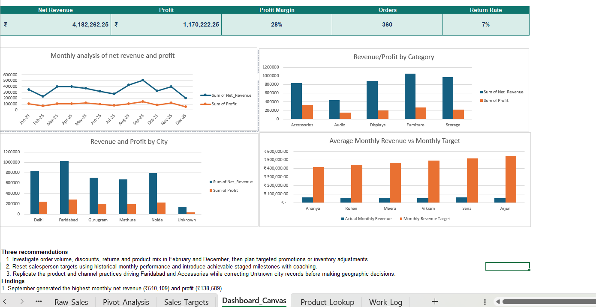

# E-commerce Sales & Profitability Dashboard

## Project overview

This Excel project converts a messy e-commerce dataset into a clean, decision-ready sales and profitability dashboard. The project covers data cleaning, lookup-based enrichment, business calculations, PivotTable analysis, KPI design, chart selection and evidence-based recommendations.

**Dataset:** Synthetic e-commerce sales data used for portfolio analysis.

## Business questions

- How much net revenue and profit did the business generate?
- Which months, cities and product categories performed best?
- What percentage of revenue became profit?
- How many orders were returned?
- How did average monthly salesperson revenue compare with the provided monthly targets?

## Dataset and data quality

- Raw records: 366
- Cleaned unique orders: 360
- Exact duplicate orders removed: 6
- Product codes missing from the lookup table: 3
- Blank city values retained as `Unknown`
- `Raw_Sales` was preserved as the untouched source sheet

## Excel workflow

1. Created a separate cleaned-data table instead of overwriting the raw data.
2. Removed exact duplicate orders and standardized city and payment-mode labels.
3. Used `XLOOKUP` to add product name, category, unit price and unit cost.
4. Flagged missing product codes instead of inventing values.
5. Calculated gross revenue, discount value, net revenue, cost, profit and profit margin.
6. Added delivery days, month and order-band analysis fields.
7. Built PivotTables for month, city, category, sales channel and salesperson.
8. Created KPI cards and four dashboard charts.
9. Built an actual-versus-target comparison on a consistent monthly basis.

## KPI results

| KPI | Result |
| --- | ---: |
| Net Revenue | ₹4,182,262.25 |
| Profit | ₹1,170,222.25 |
| Profit Margin | 28.0% |
| Orders | 360 |
| Return Rate | 6.9% |

## Key findings

1. September generated the highest monthly net revenue (₹510,109) and profit (₹138,589).
2. December generated the lowest monthly profit (₹54,699), followed by February (₹67,584).
3. Accessories generated the highest category profit (₹328,119), while Furniture generated the highest category revenue (₹1,050,342).
4. Faridabad was the strongest city, producing ₹1,028,136 in net revenue and ₹282,666 in profit.
5. None of the six salespersons met the monthly revenue target; achievement ranged from 9.5% for Arjun to 14.8% for Ananya.

## Recommendations

1. Investigate order volume, discounts, returns and product mix in February and December, then plan targeted promotions or inventory adjustments.
2. Reset salesperson targets using historical monthly performance and introduce achievable staged milestones with coaching.
3. Replicate the product and channel practices driving Faridabad and Accessories while correcting `Unknown` city records before making geographic decisions.

## Skills demonstrated

- Excel tables and structured references
- Data cleaning and standardization
- Duplicate handling and data-quality flags
- `XLOOKUP`, `IFERROR`, `IFS`, date formulas and business calculations
- PivotTables and PivotCharts
- KPI calculation and dashboard design
- Target comparison and business communication

## Repository files

- `Prashante_Ecommerce_Sales_Dashboard.xlsx` — completed Excel workbook
- `dashboard.png` — dashboard preview
- `README.md` — project explanation and results

## How to explore the workbook

1. Download and open the workbook in Microsoft Excel.
2. Review `Start Here` for the project workflow.
3. Compare `Raw_Sales` with `Cleaned_data` to see the cleaning and calculated columns.
4. Review `Pivot_Analysis` for the grouped analysis.
5. Open `Dashboard_Canvas` for KPIs, charts, findings and recommendations.

## Interview-ready explanation

I started by preserving the original data and creating a separate cleaned table. I removed six exact duplicate orders, standardized labels and used XLOOKUP to enrich each valid product code. Three missing product codes were flagged rather than replaced with invented values. I then calculated revenue, cost, profit, margin and delivery metrics, summarized the results with PivotTables and built a dashboard with five KPIs and four charts. The final analysis showed that September performed best, Accessories generated the highest category profit, Faridabad led city performance and the salesperson targets were not aligned with historical monthly results.
